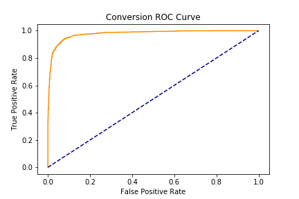
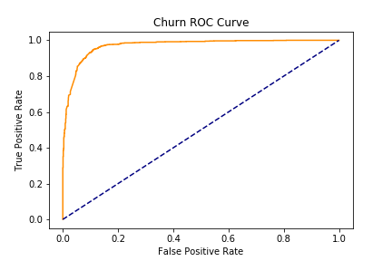
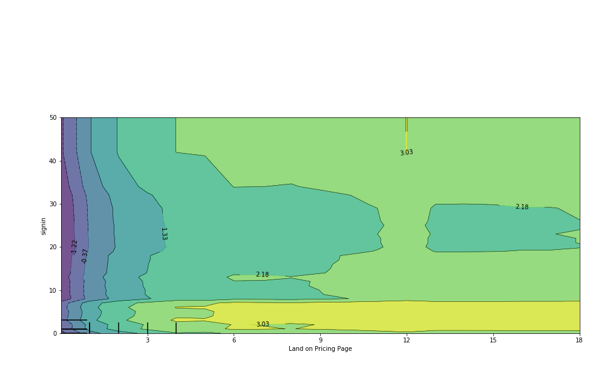
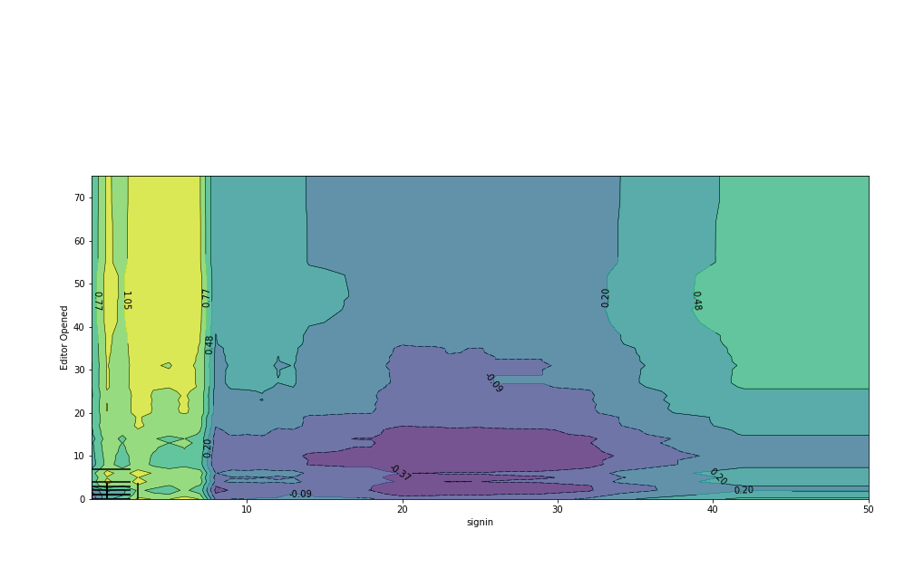
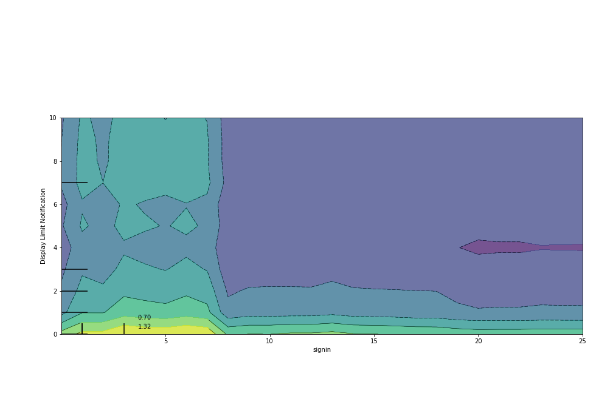

# Conversion Deck

My Capstone project for Galvanize's Data Science Immersive course.

## Business Understanding

**Objective**: Finding leading factors of conversion and churn in HaikuDeck users.

## Data Understanding

For this project, I had access to HaikuDeck's [Stripe (Payment Processor)](http://stripe.com) and [Mixpanel (User Analytics)](http://mixpanel.com) account which gave me access to payment/subscription events and in-app events.

I fetched data from their respective APIs, stored them in DynamoDB [DynamoDB](https://aws.amazon.com/dynamodb/). From there, I normalized the data and stored them in a Postgres database hosted on [RDS](https://aws.amazon.com/rds/).

I was able to fetch and store data on approximately 16,000 customers from stripe, and 7,500,000 events 300,000 distinct profiles from Mixpanel.

**Note: Data pipeline code can be found in `/src/pipeline.py`**
**Note: API Keys are stored in environment variables not stored in this repo**

## Modeling

For this project, I created two Gradient Boosting Classifiers, one for Conversion and another for Churn. Datasets were created from SQL queries on the data collected, fit to the classifiers and tuned with a GridSearch using 3 fold cross validation.

Data for fitting the models was pulled using SQL queries on stored data, aggregating the counts of different types of events. To tune my model, I used a compute optimized EC2 to do a parellelized grid search over key hyper parameters.

**Note: Models and data queries are found in the `/src/modeling` folder**

## Evaluation
Evaluation of this model can be found in the [Scoring Notebook](./notebooks/Scoring.ipynb). In which I scored my models, created ROC curves, extracted features importances, and made partial dependency plots for each model.

At this point, given feature importances I was able to determine the most important features that have lead to conversion/churn

#### Results

##### ROC Curves

##### Partial Dependency Plots

###### Landing on Pricing Page / signin

###### Editor Opened / signin

###### signin / Display Limit Notification

## Deployment
For deployment, I created a dashboard that displays predictions for current users generated by the current model.

I built this using Flask and React JS to query predictions that were previously generated and stored as a seperate table in my SQL database.

To run:

* Run asset pipeline `webpack`
* Run `python app/__init__.py`

Visit http://127.0.0.1:5000/ view the dashboard locally.
